# Database Schema Diagram

Generated from `prisma/schema.prisma` (PostgreSQL, 3 schemas: `public`, `trodo`, `v0`).

> Mermaid `erDiagram` syntax. Renders natively on GitHub, GitLab, VS Code (Mermaid extension), and most Markdown viewers.
> Cross-schema foreign keys are marked with `[cross-schema]` in the relationship label.

**Rendered exports:** [`schema.svg`](./schema.svg) · [`schema.png`](./schema.png)

## ER Diagram

```mermaid
erDiagram
    %% ===========================================================
    %% SCHEMA: public — E-commerce core
    %% ===========================================================

    makes ||--o{ models : "has"
    models ||--o{ vehicles : "has"
    vehicles ||--o{ fuel_types : "has"
    fuel_types ||--o{ engines : "has"

    users ||--o{ orders : "places"
    users ||--o{ user_vehicles : "owns"
    users ||--o{ notifications : "receives"
    users ||--o{ customer_requests : "submits"

    orders ||--o{ order_items : "contains"
    orders ||--o{ order_payments : "has"

    parts ||--o{ order_items : "ordered_in"
    parts ||--o{ part_cross_references : "has"
    parts ||--o{ part_documents : "has"
    parts ||--o{ part_eans : "has"
    parts ||--o{ part_images : "has"
    parts ||--o{ part_infos : "has"
    parts ||--o{ part_oens : "has"
    parts ||--o{ part_properties : "has"
    parts ||--o{ part_vehicle_types : "fits"
    parts ||--o{ customer_requests : "referenced_in"
    parts ||--o{ public_part_code_lookup : "indexed_in"
    parts ||--o{ product_public_part_links : "linked_from"

    part_brands ||--o{ parts : "manufactures"
    part_categories ||--o{ parts : "classifies"

    vtypes ||--o{ part_vehicle_types : "matched_to"
    vtypes ||--|| oil_capacities : "has"
    vtypes ||--|| vtype_details : "has"

    %% public standalone
    scrape_progress {
        Int id PK
        Int vehicle_type_id
        Int category_id
        Int parts_count
        DateTime scraped_at
    }

    %% ===========================================================
    %% SCHEMA: trodo — Trodo scraping layer
    %% ===========================================================

    engines ||--o{ variants : "powers [cross-schema]"
    variants ||--o{ category_tree : "has"

    %% ===========================================================
    %% SCHEMA: v0 — Supplier integration + vehicle catalog
    %% ===========================================================

    %% --- Vehicle catalog (v0) ---
    vbrands ||--o{ vmodels : "has"
    vmodels ||--o{ vtypes : "has"

    %% --- Supplier: Dinamik ---
    dnmk_brands ||--o{ dnmk_products : "manufactures"
    dnmk_products ||--o{ dnmk_product_oems : "has"
    dnmk_products ||--|| dnmk_cost : "priced"

    %% --- Supplier: ParcaTedarik ---
    ptdrk_brands ||--o{ ptdrk_products : "manufactures"

    %% --- Supplier: Başbuğ ---
    bsbg_brands ||--o{ bsbg_products : "manufactures"
    bsbg_products ||--o{ bsbg_products_oem_no : "has"
    bsbg_products ||--o{ bsbg_cost : "priced"

    %% --- Brand unification layer ---
    brand_list ||--o{ brand_mappings : "aliases"
    dnmk_brands ||--o{ brand_mappings : "mapped_from"
    ptdrk_brands ||--o{ brand_mappings : "mapped_from"
    bsbg_brands ||--o{ brand_mappings : "mapped_from"
    brand_list ||--o{ v0_products : "owns"
    brand_list ||--o{ product_mapping : "informs"
    brand_list ||--o{ products_oems : "informs"

    %% --- Product unification (v0_products = products) ---
    v0_products ||--o{ product_sources : "sourced_from"
    v0_products ||--o{ product_code_signals : "signals"
    v0_products ||--o{ product_public_part_links : "links_to_parts [cross-schema]"

    product_sources }o--|| dnmk_products : "from"
    product_sources }o--|| ptdrk_products : "from"
    product_sources }o--|| bsbg_products : "from"
    product_sources }o--o| product_mapping : "via"

    product_code_signals }o--o| product_sources : "extracted_from"

    %% --- Product mapping bridge ---
    product_mapping }o--o| dnmk_products : "maps"
    product_mapping }o--o| ptdrk_products : "maps"
    product_mapping }o--o| bsbg_products : "maps"
    product_mapping ||--o{ product_public_part_links : "produces"

    %% --- OEM cross-reference aggregation ---
    products_oems }o--o| dnmk_products : "from"
    products_oems }o--o| ptdrk_products : "from"
    products_oems }o--o| bsbg_products : "from"

    %% --- Link to public.parts ---
    product_public_part_links }o--|| parts : "matches [cross-schema]"

    %% --- Rate / cost tracking ---
    bsbg_rate {
        Int id PK
        String doviz_cinsi
        Decimal alis
        Decimal satis
        String kaynak
        DateTime tarih
    }

    %% ===========================================================
    %% ENTITY DEFINITIONS (fields)
    %% ===========================================================

    makes {
        Int id PK
        String name
        String url_key
        Boolean is_popular
    }
    models {
        Int id PK
        Int make_id FK
        String name
        Int year_from
        Int year_to
        String url_key
    }
    vehicles {
        Int id PK
        Int model_id FK
        String name
        Int year_from
        Int year_to
        String url_key
    }
    fuel_types {
        Int id PK
        Int vehicle_id FK
        String name
    }
    engines {
        Int id PK
        Int fuel_type_id FK
        String name
    }

    users {
        String id PK
        String name
        String email
        Boolean email_verified
        String password_hash
        String image
        String role
    }
    user_vehicles {
        Int id PK
        String user_id FK
        Json vehicle_data
    }
    notifications {
        BigInt id PK
        String user_id FK
        String type
        String title
        String message
        Json payload
        DateTime read_at
    }
    orders {
        Int id PK
        String user_id FK
        String guest_name
        String guest_email
        String guest_phone
        Decimal subtotal_amount
        Decimal shipping_fee
        Decimal total_amount
        String status
        String payment_status
    }
    order_items {
        Int id PK
        Int order_id FK
        BigInt part_id FK
        Int quantity
        Decimal price
    }
    order_payments {
        Int id PK
        Int order_id FK
        String provider
        String status
        Decimal amount
        DateTime paid_at
    }
    customer_requests {
        Int id PK
        String user_id FK
        BigInt part_id FK
        String request_type
        String status
        String source
        String name
        String email
    }

    parts {
        BigInt id PK
        BigInt tecdoc_article_id
        String name
        BigInt part_no
        BigInt article_link_id
        Decimal price
        Int brand_id FK
        Int category_id FK
    }
    part_brands {
        Int id PK
        String name
        String logo_url
    }
    part_categories {
        Int id PK
        String name
        Boolean is_active
        Boolean has_childs
        Int parent_id
        String url_key
        Boolean is_main_nav
    }
    part_cross_references {
        Int id PK
        String brand_name
        String article_number
        BigInt part_id FK
    }
    part_documents {
        Int id PK
        String doc_file_name
        String doc_type_name
        BigInt part_id FK
    }
    part_eans {
        Int id PK
        String code
        BigInt part_id FK
    }
    part_images {
        Int id PK
        String image
        String thumb
        BigInt part_id FK
    }
    part_infos {
        Int id PK
        String content
        BigInt part_id FK
    }
    part_oens {
        Int id PK
        String brand
        String code
        BigInt part_id FK
    }
    part_properties {
        Int id PK
        String key
        String value
        BigInt part_id FK
    }
    part_vehicle_types {
        Int id PK
        BigInt part_id FK
        Int vehicle_type_id FK
    }
    public_part_code_lookup {
        BigInt id PK
        String code_kind
        String normalized_code
        BigInt part_id FK
        String matched_code
        String match_reason
    }
    oil_capacities {
        Int id PK
        Int vehicle_type_id FK
        String brand
        String capacity
    }

    %% --- trodo ---
    variants {
        Int id PK
        Int engine_id FK
        String name
        Int year_from
        Int year_to
        String ccm
        String kw_ps
        String engine_code
        Int tecdoc_id
        Int magento_id
    }
    category_tree {
        BigInt id PK
        Int variant_id FK
        Int category_id
        Int parent_category_id
        String tree_parent_key
        Int child_position
        String name
        String url_key
        String path
        Int path_depth
        String page_type
    }

    %% --- v0 vehicle catalog ---
    vbrands {
        Int id PK
        String name
    }
    vmodels {
        Int id PK
        String name
        String date_from
        String date_to
        Int brand_id FK
    }
    vtypes {
        Int id PK
        String name
        Int cc
        String fuel_type
        Int hp
        Int kwt
        String year_of_constr_from
        String year_of_constr_to
        Int model_id FK
    }
    vtype_details {
        BigInt id PK
        Int vehicle_type_id FK
        String brake_system
        Int ccm_tech
        String construction_type
        Int cylinder
        Int power_hp_from
        Int power_kw_from
        String motor_type
        Json motor_codes
    }

    %% --- v0 supplier brands ---
    dnmk_brands {
        BigInt id PK
        String brand
    }
    ptdrk_brands {
        Int id PK
        String name
        String url_key
        String logo_url
    }
    bsbg_brands {
        BigInt id PK
        String brand
    }

    %% --- v0 supplier products ---
    dnmk_products {
        BigInt id PK
        BigInt dnmk_brands_id FK
        String stock_code
        String stock_name
        String part_no
        String barcode_1
        String image_url
        Boolean is_passive
    }
    dnmk_product_oems {
        Int id PK
        BigInt dnmk_products_id FK
        String oem_no
        String source
    }
    dnmk_cost {
        BigInt id PK
        BigInt dnmk_products_id FK
        Decimal price
        Int stock_qty
        Decimal campaign_rate
        Json regional_stock
    }

    ptdrk_products {
        Int id PK
        Int ptdrk_brands_id FK
        String product_id
        String part_no
        String title
        String url
        String ref_no
        String sku
        Decimal price_list
        Decimal price_actual
    }

    bsbg_products {
        BigInt id PK
        BigInt bsbg_brands_id FK
        String malzeme_no
        String part_no
        String aciklama
        String oem_no
        String liste_grubu_kodu
        String arac_bilgisi
        Decimal liste_fiyati
        Boolean is_passive
    }
    bsbg_products_oem_no {
        BigInt id PK
        BigInt bsbg_products_id FK
        String oem_no
        String source
    }
    bsbg_cost {
        BigInt id PK
        BigInt bsbg_products_id FK
        Decimal liste_fiyati
        String para_birimi
        Decimal kur_degeri
        Decimal fiyat_tl
        DateTime captured_at
    }

    %% --- v0 unification layer ---
    brand_list {
        Int id PK
        String brand
        String logo_url
    }
    brand_mappings {
        Int id PK
        Int brand_list_id FK
        BigInt dnmk_brands_id FK
        Int ptdrk_brands_id FK
        BigInt bsbg_brands_id FK
        String mapping_status
        String match_method
    }
    v0_products {
        BigInt id PK
        String display_name
        String normalized_name
        String brand_name
        Int brand_list_id FK
        String primary_image_url
        String status
    }
    product_sources {
        BigInt id PK
        BigInt v0_product_id FK
        String source_type
        String source_record_id
        BigInt dnmk_products_id FK
        BigInt bsbg_products_id FK
        Int ptdrk_products_id FK
        Int product_mapping_id FK
        Boolean is_primary
    }
    product_code_signals {
        BigInt id PK
        BigInt v0_product_id FK
        BigInt product_source_id FK
        String source_type
        String raw_code
        String normalized_code
        String code_kind
        String origin
        Decimal confidence
    }
    product_mapping {
        Int id PK
        BigInt dnmk_products_id FK
        Int ptdrk_products_id FK
        BigInt bsbg_products_id FK
        String part_no
        String mapping_status
        String match_method
        Int brand_list_id FK
    }
    products_oems {
        Int id PK
        BigInt dnmk_products_id FK
        Int ptdrk_products_id FK
        BigInt bsbg_products_id FK
        String oem_no
        String ref_no
        Int brand_list_id FK
        String relation_type
    }
    product_public_part_links {
        BigInt id PK
        BigInt v0_product_id FK
        BigInt part_id FK
        Int product_mapping_id FK
        String status
        String match_reason
        Decimal confidence
        DateTime approved_at
        String approved_by
    }
```

## Model Summary by Schema

### `public` — E-commerce core (13 models)

| Model | Purpose | Key relations |
|---|---|---|
| `makes` | Vehicle makes (BMW, etc.) | → models |
| `models` | Vehicle models | → vehicles; ← makes |
| `vehicles` | Vehicle body variants | → fuel_types; ← models |
| `fuel_types` | Fuel type per vehicle | → engines; ← vehicles |
| `engines` | Engine definitions | ← fuel_types; → variants (trodo) |
| `users` | Customers + admins | → orders, user_vehicles, notifications, customer_requests |
| `user_vehicles` | Saved user garage (JSON blob) | ← users |
| `notifications` | User notification inbox | ← users |
| `orders` | Orders (guest or user) | → order_items, order_payments; ← users |
| `order_items` | Order line items | ← orders, parts |
| `order_payments` | Payment provider records | ← orders |
| `customer_requests` | Part request / contact form | ← users, parts |
| `parts` | Public part catalog (BigInt PK) | → 10 detail tables, order_items, customer_requests; ← part_brands, part_categories, product_public_part_links |
| `part_brands` | Part manufacturers | → parts |
| `part_categories` | Hierarchical part categories | → parts |
| `part_cross_references` | Cross-ref numbers per part | ← parts |
| `part_documents` | PDFs / docs per part | ← parts |
| `part_eans` | EAN codes per part | ← parts |
| `part_images` | Images per part | ← parts |
| `part_infos` | Long-form info per part | ← parts |
| `part_oens` | OEM numbers per part | ← parts |
| `part_properties` | Key/value specs per part | ← parts |
| `part_vehicle_types` | Part ↔ vtypes (v0) fitment | ← parts, vtypes |
| `public_part_code_lookup` | Normalized code index for parts | ← parts |
| `oil_capacities` | Oil capacity per vtype | ← vtypes |
| `scrape_progress` | Scrape job tracking | standalone |

### `trodo` — Trodo scraping layer (2 models)

| Model | Purpose | Key relations |
|---|---|---|
| `variants` | Trodo vehicle variants (rich SEO data) | ← engines (public, cross-schema); → category_tree |
| `category_tree` | Variant-specific category tree (SEO URLs, content) | ← variants |

### `v0` — Supplier integration + vehicle catalog (16 models)

**Vehicle catalog:**

| Model | Purpose | Key relations |
|---|---|---|
| `vbrands` | Vehicle brands (Tecdoc-style) | → vmodels |
| `vmodels` | Vehicle models | → vtypes; ← vbrands |
| `vtypes` | Vehicle type variants (engine/cc/hp) | → part_vehicle_types (public, cross-schema), oil_capacities (public), vtype_details; ← vmodels |
| `vtype_details` | Rich Tecdoc details per vtype | ← vtypes |

**Supplier: Dinamik:**

| Model | Purpose | Key relations |
|---|---|---|
| `dnmk_brands` | Dinamik brand dedup list | → dnmk_products, brand_mappings |
| `dnmk_products` | Dinamik stock items (BigInt PK) | → dnmk_product_oems, dnmk_cost, product_sources, product_mapping, products_oems; ← dnmk_brands |
| `dnmk_product_oems` | OEMs extracted per product | ← dnmk_products |
| `dnmk_cost` | Live price + stock snapshot | ← dnmk_products (1:1) |

**Supplier: ParcaTedarik:**

| Model | Purpose | Key relations |
|---|---|---|
| `ptdrk_brands` | ParcaTedarik brands | → ptdrk_products, brand_mappings |
| `ptdrk_products` | Scraped ParcaTedarik products | → product_sources, product_mapping, products_oems; ← ptdrk_brands |

**Supplier: Başbuğ:**

| Model | Purpose | Key relations |
|---|---|---|
| `bsbg_brands` | Başbuğ brands | → bsbg_products, brand_mappings |
| `bsbg_products` | Başbuğ MalzemeleriGetir items | → bsbg_products_oem_no, bsbg_cost, product_sources, product_mapping, products_oems; ← bsbg_brands |
| `bsbg_products_oem_no` | OEMs per product | ← bsbg_products |
| `bsbg_cost` | Historical price snapshots | ← bsbg_products |
| `bsbg_rate` | Daily FX rates (standalone) | standalone |

**Unification layer:**

| Model | Purpose | Key relations |
|---|---|---|
| `brand_list` | Canonical unified brand | → brand_mappings, v0_products, product_mapping, products_oems |
| `brand_mappings` | Maps supplier brands → canonical | ← brand_list, dnmk_brands, ptdrk_brands, bsbg_brands |
| `v0_products` (table `products`) | Unified product record | → product_sources, product_code_signals, product_public_part_links; ← brand_list |
| `product_sources` | Provenance: v0_product ← which supplier row | ← v0_products, dnmk_products, ptdrk_products, bsbg_products, product_mapping |
| `product_code_signals` | Normalized codes extracted from sources | ← v0_products, product_sources |
| `product_mapping` | Legacy mapping bridge table | ← product_sources, product_public_part_links; → dnmk/ptdrk/bsbg_products |
| `products_oems` | Aggregated OEM refs across suppliers | ← dnmk/ptdrk/bsbg_products, brand_list |
| `product_public_part_links` | v0_products ↔ public.parts candidate matches | ← v0_products, product_mapping, parts (cross-schema) |

## Foreign Key Reference Table

All `@relation` foreign keys with `onDelete` behavior. **Bold** = cross-schema FK.

| Child model | Field | Parent model | onDelete | Cardinality |
|---|---|---|---|---|
| `models` | `make_id` | `makes` | NoAction | N:1 |
| `vehicles` | `model_id` | `models` | NoAction | N:1 |
| `fuel_types` | `vehicle_id` | `vehicles` | NoAction | N:1 |
| `engines` | `fuel_type_id` | `fuel_types` | NoAction | N:1 |
| `orders` | `user_id` | `users` | NoAction | N:1 (nullable) |
| `user_vehicles` | `user_id` | `users` | NoAction | N:1 |
| `notifications` | `user_id` | `users` | Cascade | N:1 |
| `customer_requests` | `user_id` | `users` | SetNull | N:1 (nullable) |
| `customer_requests` | `part_id` | `parts` | SetNull | N:1 (nullable) |
| `order_items` | `order_id` | `orders` | Cascade | N:1 |
| `order_items` | `part_id` | `parts` | NoAction | N:1 |
| `order_payments` | `order_id` | `orders` | Cascade | N:1 |
| `parts` | `brand_id` | `part_brands` | NoAction | N:1 |
| `parts` | `category_id` | `part_categories` | NoAction | N:1 |
| `part_cross_references` | `part_id` | `parts` | Cascade | N:1 |
| `part_documents` | `part_id` | `parts` | Cascade | N:1 |
| `part_eans` | `part_id` | `parts` | Cascade | N:1 |
| `part_images` | `part_id` | `parts` | Cascade | N:1 |
| `part_infos` | `part_id` | `parts` | Cascade | N:1 |
| `part_oens` | `part_id` | `parts` | Cascade | N:1 |
| `part_properties` | `part_id` | `parts` | Cascade | N:1 |
| `part_vehicle_types` | `part_id` | `parts` | Cascade | N:1 |
| `part_vehicle_types` | `vehicle_type_id` | `vtypes` (**v0**) | Cascade | N:1 |
| `public_part_code_lookup` | `part_id` | `parts` | Cascade | N:1 |
| `oil_capacities` | `vehicle_type_id` | `vtypes` (**v0**) | Cascade | 1:1 |
| `vtype_details` | `vehicle_type_id` | `vtypes` | Cascade | 1:1 |
| **`variants`** (trodo) | `engine_id` | **`engines`** (public) | NoAction | N:1 |
| `category_tree` | `variant_id` | `variants` | Cascade | N:1 |
| `vmodels` | `brand_id` | `vbrands` | NoAction | N:1 |
| `vtypes` | `model_id` | `vmodels` | NoAction | N:1 |
| `dnmk_products` | `dnmk_brands_id` | `dnmk_brands` | Restrict | N:1 |
| `dnmk_product_oems` | `dnmk_products_id` | `dnmk_products` | Cascade | N:1 |
| `dnmk_cost` | `dnmk_products_id` | `dnmk_products` | Cascade | 1:1 |
| `ptdrk_products` | `ptdrk_brands_id` | `ptdrk_brands` | Cascade | N:1 |
| `bsbg_products` | `bsbg_brands_id` | `bsbg_brands` | Restrict | N:1 |
| `bsbg_products_oem_no` | `bsbg_products_id` | `bsbg_products` | Cascade | N:1 |
| `bsbg_cost` | `bsbg_products_id` | `bsbg_products` | Cascade | N:1 |
| `brand_mappings` | `brand_list_id` | `brand_list` | Cascade | N:1 |
| `brand_mappings` | `dnmk_brands_id` | `dnmk_brands` | Cascade | N:1 (nullable) |
| `brand_mappings` | `ptdrk_brands_id` | `ptdrk_brands` | Cascade | N:1 (nullable) |
| `brand_mappings` | `bsbg_brands_id` | `bsbg_brands` | Cascade | N:1 (nullable) |
| `v0_products` | `brand_list_id` | `brand_list` | SetNull | N:1 (nullable) |
| `product_sources` | `v0_product_id` | `v0_products` | Cascade | N:1 |
| `product_sources` | `dnmk_products_id` | `dnmk_products` | Cascade | N:1 (nullable) |
| `product_sources` | `bsbg_products_id` | `bsbg_products` | Cascade | N:1 (nullable) |
| `product_sources` | `ptdrk_products_id` | `ptdrk_products` | Cascade | N:1 (nullable) |
| `product_sources` | `product_mapping_id` | `product_mapping` | SetNull | N:1 (nullable) |
| `product_code_signals` | `v0_product_id` | `v0_products` | Cascade | N:1 |
| `product_code_signals` | `product_source_id` | `product_sources` | Cascade | N:1 (nullable) |
| `product_mapping` | `dnmk_products_id` | `dnmk_products` | Cascade | N:1 (nullable) |
| `product_mapping` | `ptdrk_products_id` | `ptdrk_products` | Cascade | N:1 (nullable) |
| `product_mapping` | `bsbg_products_id` | `bsbg_products` | Cascade | N:1 (nullable) |
| `product_mapping` | `brand_list_id` | `brand_list` | SetNull | N:1 (nullable) |
| `products_oems` | `dnmk_products_id` | `dnmk_products` | Cascade | N:1 (nullable) |
| `products_oems` | `ptdrk_products_id` | `ptdrk_products` | Cascade | N:1 (nullable) |
| `products_oems` | `bsbg_products_id` | `bsbg_products` | Cascade | N:1 (nullable) |
| `products_oems` | `brand_list_id` | `brand_list` | SetNull | N:1 (nullable) |
| `product_public_part_links` | `v0_product_id` | `v0_products` | Cascade | N:1 |
| **`product_public_part_links`** (v0) | `part_id` | **`parts`** (public) | Cascade | N:1 |
| `product_public_part_links` | `product_mapping_id` | `product_mapping` | SetNull | N:1 (nullable) |

## Key Architectural Notes

1. **Three PostgreSQL schemas** in one DB: `public` (e-commerce core), `trodo` (legacy Trodo scraper), `v0` (supplier integration + vehicle catalog).
2. **Cross-schema FKs** exist and are enforced by Postgres:
   - `trodo.variants.engine_id` → `public.engines.id`
   - `public.part_vehicle_types.vehicle_type_id` → `v0.vtypes.id`
   - `public.oil_capacities.vehicle_type_id` → `v0.vtypes.id`
   - `v0.product_public_part_links.part_id` → `public.parts.id`
3. **`parts.id` is `BigInt`** (not autoincrement) — IDs are sourced externally (Tecdoc article IDs etc.).
4. **Unification flow**: `dnmk/ptdrk/bsbg_products` → `product_sources`/`product_mapping` → `v0_products` (mapped to table `products`) → `product_public_part_links` → `public.parts` (candidate/approved links with confidence score).
5. **Brand unification**: `dnmk_brands`/`ptdrk_brands`/`bsbg_brands` → `brand_mappings` → `brand_list` (canonical).
6. **`v0_products` uses `@@map("products")`** — table name differs from model name.
7. **`parts` is the source of truth** for the public catalog; `v0_products` is the unified supplier product that gets linked to a `parts` row via `product_public_part_links` (status: `CANDIDATE`/approved).
8. **Two parallel vehicle taxonomies**: `public.makes/models/vehicles` + `v0.vbrands/vmodels/vtypes` — the bridge is `part_vehicle_types` (fits v0.vtypes) and `trodo.variants` (references public.engines).

## Regeneration

This file is generated from `prisma/schema.prisma`. After schema changes, re-derive:
1. ER diagram block (Mermaid `erDiagram` syntax)
2. Model summary tables
3. FK reference table (run `rg "@relation" prisma/schema.prisma`)

For automated regenerations consider adding `prisma-erd-generator` to `schema.prisma`.